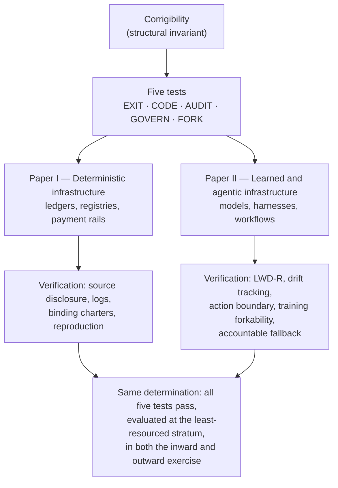

# Corrigibility Framework

[](https://github.com/anivar/corrigibility-framework/releases/latest)
[](https://creativecommons.org/publicdomain/zero/1.0/)
[](https://orcid.org/0009-0009-8995-0005)
[](https://github.com/anivar/corrigibility-framework/graphs/traffic)

A structural framework for evaluating **Digital Public Infrastructure (DPI)** and **Epistemic Public Infrastructure (EPI)**.

**Read the papers online:** [the framework](https://anivar.net/papers/dpi/) · [the extension to learned and agentic systems](https://anivar.net/papers/epi/) — HTML editions built from this repository's sources, with the framework in one page at [anivar.net/corrigibility](https://anivar.net/corrigibility/).

**Corrigibility**: The structural capacity of those affected by a system to detect error, signal harm, and trigger correction—without incurring material loss or irreversible consequence.

## One Theory, Two Substrates

The two papers form a single research programme. Paper I derives corrigibility as a structural invariant of public infrastructure: five jointly necessary conditions that close the corrective loop. Paper II shows the invariant survives the replacement of deterministic rules by learned inference and agentic execution. What changes across the substrate transition is the verification machinery, never the conditions.



The per-test mapping is in the table below; the papers' shared glossary keeps the terminology identical across both.

## Downloads

| Paper | Focus | Source | Latest PDF |
|-------|-------|--------|------------|
| **Paper I: DPI** | Deterministic infrastructure (ledgers, registries, payment rails) | [`papers/dpi/main.tex`](papers/dpi/main.tex) | [PDF](https://github.com/anivar/corrigibility-framework/releases/latest/download/corrigibility-framework-dpi.pdf) |
| **Paper II: EPI** | Learned/agentic systems (AI, ML models) | [`papers/epi/main.tex`](papers/epi/main.tex) | [PDF](https://github.com/anivar/corrigibility-framework/releases/latest/download/corrigibility-framework-ai.pdf) |

## Build

Requires TeX Live (`texlive-latex-extra`, `texlive-science`, `texlive-publishers`),
`latexmk`, and `biber`. Then:

```bash
just         # build both papers
just dpi     # DPI only
just epi     # EPI only
just publish # stage release artifacts under dist/
```

## The Five Tests

| Test | Question | DPI Focus | EPI Focus |
|------|----------|-----------|-----------|
| **EXIT** | Can users refuse participation without penalty? | Non-digital alternative or verified FEE | Appeal to an accountable authority independent of the deciding system |
| **CODE** | Is the system's execution observable? | Source code | LWD-R (Logic, Weights, Data, Representation) |
| **AUDIT** | Can independent parties verify behavior? | Transaction logs | Statistical bounds + drift monitoring |
| **GOVERN** | Do affected populations have binding authority? | RFC/charter process | Action boundary protocol |
| **FORK** | Can the system be replaced without permission? | Code + data portability | Compute accessibility |

**Fatal Failure Property**: Failure of any single test disqualifies a system from designation as public infrastructure.

## Schemas

See the [corrigibility-schema](https://github.com/anivar/corrigibility-schema) repository (Protocol 3.1) for:

- **Schemas**: `infrastructure.json` (Operator's Affidavit) and `audit.json` (Auditor's Finding) for DPI/EPI
- **AGENTS.md**: invariants for agents operating either protocol role
- **Examples**: Reference documents exercising every field

## Key Concepts

### DPI (Paper I)
- **Functional Exit Equivalence (FEE)**: Architectural guarantees that recreate error-signal strength when literal exit is impossible
- **Rule of the Ledger**: When authority is exerted through synchronized, self-executing artifacts

### EPI (Paper II)
- **LWD-R**: Four-layer transparency (Logic, Weights, Data, Representation)
- **Action Boundary Protocol**: Deterministic envelope around stochastic inference
- **Variety Drift**: The growing gap between frozen model variety and evolving environmental variety
- **Compute Capture**: When "open weights" fails FORK due to prohibitive retraining costs

## Citation

```bibtex
@article{aravind2026corrigibility-dpi,
  author = {Aravind, Anivar A},
  title  = {Corrigibility as a Structural Precondition for Digital Public Infrastructure},
  year   = {2026},
  doi    = {10.2139/ssrn.6059075},
  note   = {Zenodo (all versions): 10.5281/zenodo.18213694}
}

@article{aravind2026corrigibility-epi,
  author = {Aravind, Anivar A},
  title  = {Epistemic Capture and the Action Boundary},
  year   = {2026},
  doi    = {10.2139/ssrn.6669318},
  note   = {Zenodo (all versions): 10.5281/zenodo.19863649}
}
```

Two identifiers per paper, deliberately. The SSRN DOI carries the current text.
The Zenodo concept DOI resolves to the newest deposited version and is the
durable, open-access record — it does not disappear if a preprint server
changes its terms.

## License

[CC0 1.0](https://creativecommons.org/publicdomain/zero/1.0/) (Public Domain)

## Author

**Anivar A Aravind** · [ORCID: 0009-0009-8995-0005](https://orcid.org/0009-0009-8995-0005)
